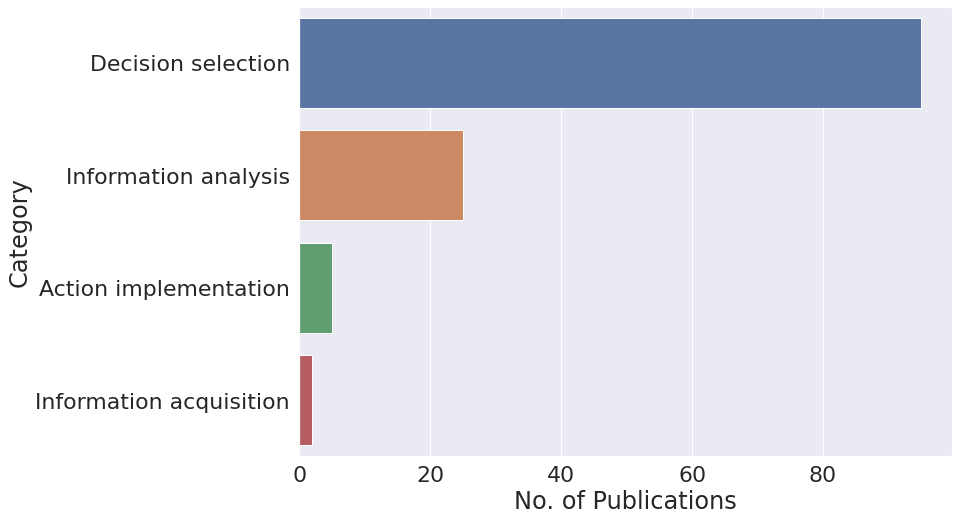
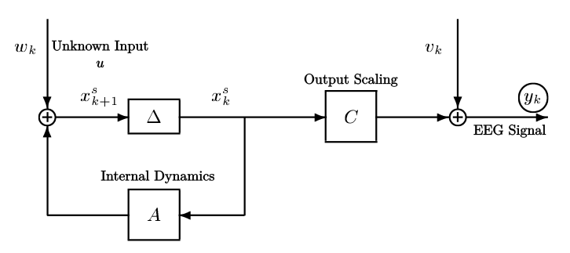
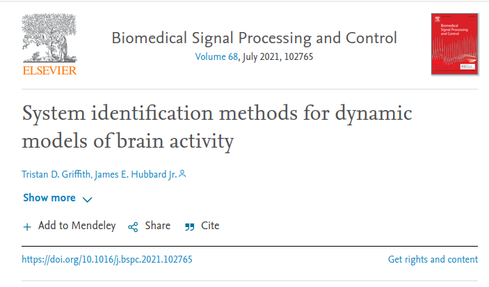
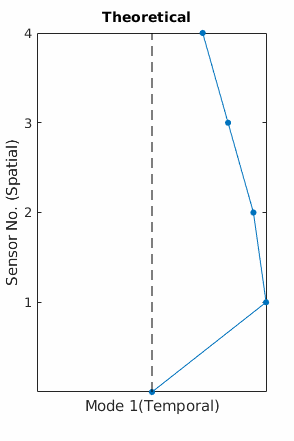
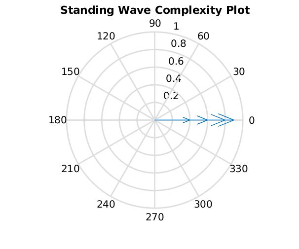
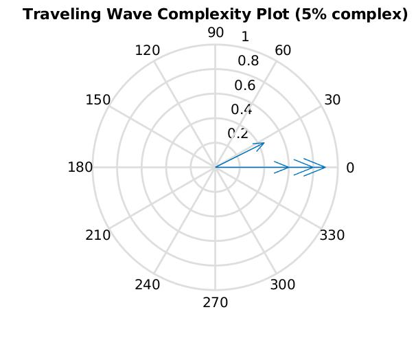
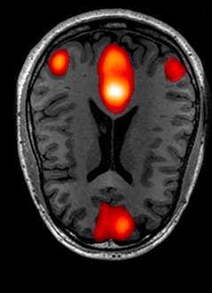
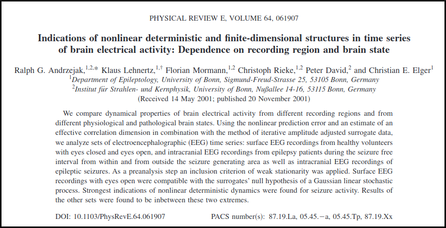
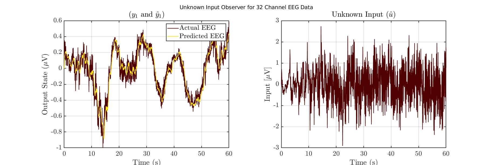

<!-- .slide: data-background="#ffffff" class="dark" -->

## A Modal Approach to the Dynamics of Human Affect 

### T. Griffith
Preliminary Examination

May 20, 2021

---

<!-- .slide: data-background="#ffffff" class="light" -->

## 1. Motivation
## 2. Approach
## 3. Timeline

---

<!-- .slide: data-background="#ffffff" class="light" -->

## 1. Motivation

---

<!-- .slide: data-background="#ffffff" class="light" -->

## Robots that work with humans are increasingly prevalent

 <a href="https://www.wired.co.uk/article/robots-in-the-workplace">Spencer Lowell</a>, Wired, 2021

 <a href="https://www.army.mil/article/240584/army_conducts_major_milestone_tests_in_development_of_next_gen_fighting_system">Bridgett Siter</a>, Army, 2020

---

## Shared flow of information is implied

 Barnes, Michael J., Jessie Y. Chen, and Susan Hill. Humans and autonomy: Implications of shared decision making for military operations. US Army Research Laboratory Aberdeen Proving Ground United States, 2017.

---

<!-- .slide: data-background="#ffffff" class="light" -->

## Not just performance

- Automation conundrum
- When SA is lost, [bad](https://dspace.mit.edu/handle/1721.1/70967) [things](https://sanfrancisco.cbslocal.com/2021/05/14/tesla-fatal-california-crash-fontana-was-on-autopilot-chp-says/) [happen](https://features.propublica.org/navy-uss-mccain-crash/navy-installed-touch-screen-steering-ten-sailors-paid-with-their-lives/)

---

<!-- .slide: data-background="#ffffff" class="light" -->

###  Need descriptions of human cognition and decision making as it is relevant to the ***dynamics*** of human-robot interaction.

- Rigorous
- Transparent
- Non-invasive
- Physiological

---

<!-- .slide: data-background="#ffffff" class="light" -->

##  How is it done now?

---

<!-- .slide: data-background="#ffffff" class="light" -->

##  How is it done now?

---

<!-- .slide: data-background="#ffffff" class="light" -->

## 2. Approach

---

<!-- .slide: data-background="#ffffff" class="light" -->

## Key Components of the Approach

---

<!-- .slide: data-background="#ffffff" class="light" -->
## 1. EEG is the measure of choice

- Lots of existing knowledge
- Widely available
- Implementation

---

<!-- .slide: data-background="#ffffff" class="light" -->
## 2. System Identification

---

<!-- .slide: data-background="#ffffff" class="light" -->
## 3. State space
$x(k+1)=Ax(k)$

$y(k)=Cx(k)$ 

---

<!-- .slide: data-background="#ffffff" class="light" -->
## 4. Modal decomposition
$A=W \Lambda V$

$A=\begin{bmatrix} w_1 & w_2 &  \ldots & w_n \end{bmatrix} \begin{bmatrix} \lambda_1 & \ldots & 0 \\\ \vdots & \ddots & \vdots \\\ 0 & \ldots & \lambda_n \end{bmatrix} \begin{bmatrix} v_1^T \\\ v_2^T \\\ \vdots \\\ v_n^T \end{bmatrix}$ 

---

<!-- .slide: data-background="#ffffff" class="light" -->

## Modeling Overview

---

<!-- .slide: data-background="#ffffff" class="light" -->

---

<!-- .slide: data-background="#ffffff" class="light" -->

## Brain Modes  are Traveling and Standing
<section>

</section>

<section>

</section>

<section>

#### - Comparing normalized complexity plots from two output only decompositions

</section>

---

<!-- .slide: data-background="#ffffff" class="light" -->

## Brain Modes are Physically Significant
#### - An Eigenmode from 32 Channel EEG DEAP data

---

<!-- .slide: data-background="#ffffff" class="light" -->

## Brain Modes are Interpersonally Dependent
#### - Subject Identification from BW Modes (Random Forrest)

---

<!-- .slide: data-background="#ffffff" class="light" -->

## Some Brain Modes are not Interpersonally Dependent

<table>
  <tr>
    <td></td>
    <td></td>
  </tr>
  <tr>
    <td>Subject 1: Alpha Mode 1</td>
    <td>Subject 2: Alpha Mode 1</td>
  </tr>
 </table>

---

<!-- .slide: data-background="#ffffff" class="light" -->

## Unique Aspects of the Approach
- Online
- Robust Features
- Spatio-temporal
- Linear systems 

---

<!-- .slide: data-background="#ffffff" class="light" -->

## Assumptions and Corner Conditions
- Input is ***unknown***, persistent 
- Stationary
- Scaled
- Linear (!)

---

<!-- .slide: data-background="#ffffff" class="light" -->

## Linearity and the Brain

:anguished:

---

<!-- .slide: data-background="#ffffff" class="light" -->

## We Must Expect Non-Linear Effects
Leverage the model framework

<!-- .slide: data-background="#ffffff" class="light" -->

---

<!-- .slide: data-background="#ffffff" class="light" -->

## An Adaptive Modal Approach 

---

<!-- .slide: data-background="#ffffff" class="light" -->

## Adaptive UIOs

<section>

</section>
<section>

### Input Generation

 

</section>

<section>

#### - Toy UIO Example with Uncertain Dynamics

</section>

---

<!-- .slide: data-background="#ffffff" class="light" -->

## Adaptive UIOs for EEG

---

<!-- .slide: data-background="#ffffff" class="light" -->

## 3. Timeline

---

<!-- .slide: data-background="#ffffff" class="light" -->

## Task Breakdown
- Modeling outcomes and affect
- Improve UIO fidelity
- Quantum extensions and decision making (stretch)

---

<!-- .slide: data-background="#ffffff" class="light" -->

### A Burst of Delight

