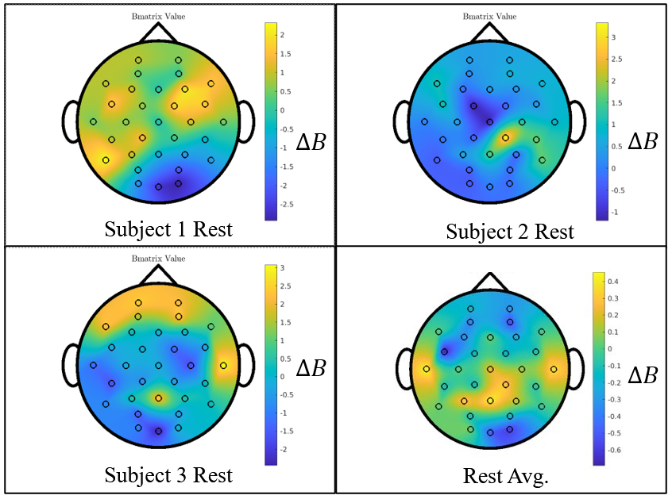

<!-- .slide: data-background="#500000" class="dark" -->

# An Unknown B Matrix with Unknown Inputs

## T. Griffith
#### Quantum Seminar

#### July 09, 2021

---

<!-- .slide: data-background="#ffffff" class="light" -->

# 1. fMRI Comparisons
# 2. UIO Recap
# 3. Optimized Parameterizations
# 4. Identifying the "Best Fit" B Matrix for the Brain
# 5. Application to Emotion Data
# 6. Application to Movement Data
# 7. Perturbations

---

<!-- .slide: data-background="#ffffff" class="light" -->

## 1. fMRI Comparisons

---

<!-- .slide: data-background="#ffffff" class="light" -->

## Mode 1

---

<!-- .slide: data-background="#ffffff" class="light" -->

## 2. UIO Recap

---

<!-- .slide: data-background="#ffffff" class="light" -->

# UIO Review: Estimator Architecture

---

<!-- .slide: data-background="#ffffff" class="light" -->

# A Polynomial Basis
{$1,x,x^2,x^3,\ldots,x^n$}

$u(t)=1+2t+0.5t^2$

<blockquote cite="http://www.worldwildlife.org/who/index.html">
    In some cases the natural basis functions for $u(t)$ are not clearly defined by the available data. For such cases it is usually effective to use a polynomial spline waveform-model
</blockquote>

 <small>Johnson, C. D. (1989, January). Effective techniques for the identification and accommodation of disturbances. In Pros. 3rd Annual NASA/DOD Controls-Structures Interaction (CSI) Technical Conf. (p. 163).</small>

---

<!-- .slide: data-background="#ffffff" class="light" -->

# Polynomial Basis Comparison: Fourier 1-300 hz

---

<!-- .slide: data-background="#ffffff" class="light" -->

# Polynomial Basis Comparison: 1-6th 

---

<!-- .slide: data-background="#ffffff" class="light" -->

# Some Obscured Assumptions

- $B=I$
 - $\dot{x}=Ax+Bu$
- SIMO 

---

<!-- .slide: data-background="#ffffff" class="light" -->

# A Better B Matrix?
- Alter B to improve modeling error $e_y$
 - Convex Optimization

---

<!-- .slide: data-background="#ffffff" class="light" -->

## 3. Optimized Parameterizations

---

<!-- .slide: data-background="#ffffff" class="light" -->

# Convex Optimization
an optimization problem in which the objective function is a ***convex function*** and the feasible set is a ***convex set***

---

<!-- .slide: data-background="#ffffff" class="light" -->

# the objective function is a ***convex function***

 <small>
<a href="https://en.wikipedia.org/wiki/Convex_function#/media/File:ConvexFunction.svg">Image Source</a>
</small>

---

<!-- .slide: data-background="#ffffff" class="light" -->

# the feasible set is a ***convex set***

 <small>
<a href="https://en.wikipedia.org/wiki/Convex_set">Image Source</a>
</small>

---

<!-- .slide: data-background="#ffffff" class="light" -->

# Important Properties of Convex Problems
- every local minimum is a global minimum
- gradient descent converges in polynomial time

---

<!-- .slide: data-background="#ffffff" class="light" -->

## 4. Best Fit B Matricies

---

<!-- .slide: data-background="#ffffff" class="light" -->

# *A* Convex Function for B matrix optimization
- $\min ||y-\hat{y}-C \Delta B \hat{u}||_2$
- ***not*** the only possible minimization

---

<!-- .slide: data-background="#ffffff" class="light" -->

# B Matrix Optimization Example
- 3x3 example
 - $\dot{\hat{x}} = A_m x + B \hat{u}$
 - $A_m \neq A$ 
- ***$\min ||y-\hat{y}-C \Delta B \hat{u}||_2$***
- $B=\begin{bmatrix} 1.2 \\\ 1 \\\ 1.6 \end{bmatrix}$, 
- $B_m=\begin{bmatrix} 1 \\\ 1 \\\ 1 \end{bmatrix}$

---

<!-- .slide: data-background="#ffffff" class="light" -->

# B Matrix Optimization Example
- $\min ||y-\hat{y}-C \Delta B \hat{u}||_2$
- $\Delta B=\begin{bmatrix} 0.18 \\\ 0 \\\ 0.37 \end{bmatrix}$, 
- $B_f=\begin{bmatrix} 1.18 \\\ 1 \\\ 1.37 \end{bmatrix}$

---

<!-- .slide: data-background="#ffffff" class="light" -->

# B Matrix on EEG Data

---

<!-- .slide: data-background="#ffffff" class="light" -->

# B Matrix on EEG Data

---

<!-- .slide: data-background="#ffffff" class="light" -->

# Current models

---

<!-- .slide: data-background="#ffffff" class="light" -->

## 5. Application to Emotion Data

---

<!-- .slide: data-background="#ffffff" class="light" -->

## B Matrix on EEG Data: ***Satisfaction (T1)*** 

---

<!-- .slide: data-background="#ffffff" class="light" -->

## B Matrix on EEG Data: ***Surprise (T2)*** 

---

<!-- .slide: data-background="#ffffff" class="light" -->

## B Matrix on EEG Data: ***Fear (T8)*** 

---

<!-- .slide: data-background="#ffffff" class="light" -->

## B Matrix on EEG Data: ***HVHA (T13)*** 

---

<!-- .slide: data-background="#ffffff" class="light" -->
## Comparing the same "emotion"

 <small>Mneimne, M., Powers, A. S., Walton, K. E., Kosson, D. S., Fonda, S., & Simonetti, J. (2010). Emotional valence and arousal effects on memory and hemispheric asymmetries. Brain and Cognition, 74(1), 10-17.</small>

---

<!-- .slide: data-background="#ffffff" class="light" -->

## B Matrix on EEG Data: ***HVHA*** 

---

<!-- .slide: data-background="#ffffff" class="light" -->

## B Matrix on EEG Data: ***HVLA*** 

---

<!-- .slide: data-background="#ffffff" class="light" -->

## B Matrix on EEG Data: ***LVHA*** 

---

<!-- .slide: data-background="#ffffff" class="light" -->

## B Matrix on EEG Data: ***LVLA***  

---

<!-- .slide: data-background="#ffffff" class="light" -->

## B Matrix on EEG Data: ***Avg. Quadrants***  

---

<!-- .slide: data-background="#ffffff" class="light" -->

## 6. Application to Movement Data

---

<!-- .slide: data-background="#ffffff" class="light" -->

## B Matrix on EEG Data: ***Left Hand***  

---

<!-- .slide: data-background="#ffffff" class="light" -->

## B Matrix on EEG Data: ***Right Hand***  

---

<!-- .slide: data-background="#ffffff" class="light" -->

## B Matrix on EEG Data: ***Resting***  

---

<!-- .slide: data-background="#ffffff" class="light" -->

## B Matrix on EEG Data: ***All Averages***  

---

<!-- .slide: data-background="#ffffff" class="light" -->

## 7. Perturbations (V.)

---

<!-- .slide: data-background="#ffffff" class="light" -->

## Systems with unmodeled dynamics
- $\dot{x}=A_m x + B_m u$
- $y=C_m x$
- b.c. of uncertainty in real parameters:
 - $A_m = A + \sum \delta_i A_i$
 - $B_m = B + \sum \delta_i B_i$
 - $C_m = C+ \sum \delta_i C_i$

---

<!-- .slide: data-background="#ffffff" class="light" -->

## Collect the uncertainty 
- $A_m = A + \sum \delta_i A_i = A+W_2 \Delta W_1$

---

<!-- .slide: data-background="#ffffff" class="light" -->

## Simple Example
- $A= \begin{bmatrix} -3 & -2 \\\ 7 & -1 \end{bmatrix}$
- Parametric uncertainty in 2 degrees:
 - $A_1=\begin{bmatrix} -w_1 & w_1 \\\ w_1 & -w_1 \end{bmatrix}$
 - $A_2=\begin{bmatrix} 0 & -w_2 \\\ 2 w_2 & 0 \end{bmatrix}$

- $A_m = A + \delta_1 \begin{bmatrix} -w_1 & w_1 \\\ w_1 & -w_1 \end{bmatrix} + \delta_2 \begin{bmatrix} 0 & -w_2 \\\ 2 w_2 & 0 \end{bmatrix}$
- $A_m = A + \begin{bmatrix} -w_1 & 0 & -w_2 \\\ w_1 & 2 w_2 & 0 \end{bmatrix} \begin{bmatrix} \delta_1 & 0 & 0 \\\ 0 & \delta_2 & 0 \\\ 0 & 0 & \delta_2 \end{bmatrix} \begin{bmatrix} 1 & -1 \\\ 1 & 0 \\\ 0 & 1 \end{bmatrix} $ 

---

<!-- .slide: data-background="#ffffff" class="light" -->

## EEG Example

