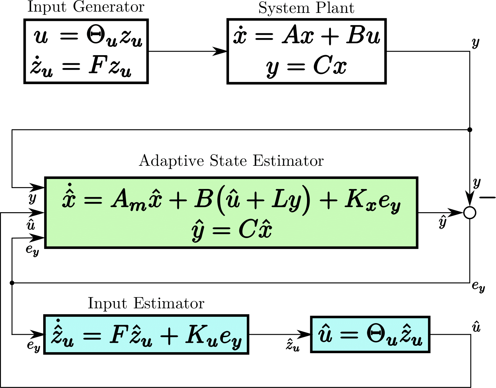
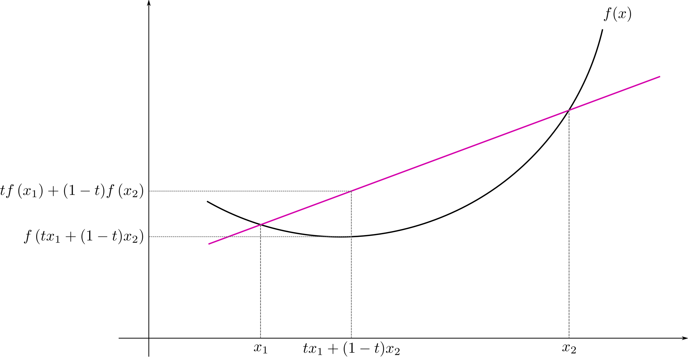

<!-- .slide: data-background="#500000" class="dark" -->

# An Unknown B Matrix with Unknown Inputs

## T. Griffith
#### Quantum Seminar

#### July 09, 2021

---

<!-- .slide: data-background="#ffffff" class="light" -->

# 1. UIO Recap
# 2. Optimization of Linear Systems
# 3. Identifying the "Best Fit" B Matrix for the Brain
# 4. Application to Emotion Data
# 5. Application to Movement Data
# 6. Perterbations

---

<!-- .slide: data-background="#ffffff" class="light" -->

# UIO Review: Estimator Architecture

---

<!-- .slide: data-background="#ffffff" class="light" -->

# A Polynomial Basis

{$1,x,x^2,x^3,\ldots,x^n$}

$1+2t+0.5t^2$

---

<!-- .slide: data-background="#ffffff" class="light" -->

# Polynomial Basis Comparison: Fourier 1-300 hz

---

<!-- .slide: data-background="#ffffff" class="light" -->

# Polynomial Basis Comparison: 1-6th 

---

<!-- .slide: data-background="#ffffff" class="light" -->

# Some Obscured Assumptions

- $B=I$
 - $\dot{x}=Ax+Bu$
- SIMO 

---

<!-- .slide: data-background="#ffffff" class="light" -->

# A Better B Matrix?
- Alter B to improve modeling error $e_y$
 - Convex Optimization

---

<!-- .slide: data-background="#ffffff" class="light" -->

# Convex Optimization
an optimization problem in which the objective function is a ***convex function*** and the feasible set is a ***convex set***

---

<!-- .slide: data-background="#ffffff" class="light" -->

# the objective function is a ***convex function***

---

<!-- .slide: data-background="#ffffff" class="light" -->

# the feasible set is a ***convex set***

---

<!-- .slide: data-background="#ffffff" class="light" -->

# Important Properties of Convex Problems
- every local minimum is a global minimum
- gradient descent converges in polynomial time

---

<!-- .slide: data-background="#ffffff" class="light" -->

# *A* Convex Function for B matrix optimization
- $\min ||y-\hat{y}-C \Delta B \hat{u}||_2$
- ***not*** the only possible minimization

---

<!-- .slide: data-background="#ffffff" class="light" -->

# B Matrix Optimization Example
- $\min ||y-\hat{y}-C \Delta B \hat{u}||_2$
- $B=\begin{bmatrix} 1.2 \\\ 1 \\\ 1.6 \end{bmatrix}$, $B_m=\begin{bmatrix} 1 \\\ 1 \\\ 1 \end{bmatrix}$
- $\Delta B=\begin{bmatrix} 0.18 \\\ 0 \\\ 0.37 \end{bmatrix}$, $B_f=\begin{bmatrix} 1.18 \\\ 1 \\\ 1.37 \end{bmatrix}$

---

<!-- .slide: data-background="#ffffff" class="light" -->

# B Matrix Optimization Example
- $\min ||y-\hat{y}-C \Delta B \hat{u}||_2$

---

<!-- .slide: data-background="#ffffff" class="light" -->

# B Matrix on EEG Data

---

<!-- .slide: data-background="#ffffff" class="light" -->

# B Matrix on EEG Data

---

<!-- .slide: data-background="#ffffff" class="light" -->

# B Matrix Maps

---

<!-- .slide: data-background="#ffffff" class="light" -->
<section>

<h2> B Matrix on EEG Data: ***Satisfaction*** </h2>

</section>

<section>

</section>

---

<!-- .slide: data-background="#ffffff" class="light" -->

<section>
<h2> B Matrix on EEG Data: ***Surprise*** </h2>

</section>

<section>

</section>

---

<!-- .slide: data-background="#ffffff" class="light" -->

<h2> B Matrix on EEG Data: ***Fear*** </h2>
<section>

</section>

<section>

</section>

---

<!-- .slide: data-background="#ffffff" class="light" -->
<section>

<h2> B Matrix on EEG Data: ***HVHA*** </h2>
<table>
  <tr>
    <td></td>
    <td></td>
  </tr>
  <tr>
    <td style="text-align: center; vertical-align: middle;">Subject 1: HVHA</td>
    <td style="text-align: center; vertical-align: middle;">Subject 2: HVHA</td>
  </tr>
  <tr>
    <td></td>
    <td></td>
  </tr>
  <tr>
    <td style="text-align: center; vertical-align: middle;">Subject 3: HVHA</td>
    <td style="text-align: center; vertical-align: middle;">Subject 4: HVHA</td>
  </tr>
 </table>

</section>

<section>

</section>

---

<!-- .slide: data-background="#ffffff" class="light" -->
<section>
<h2> B Matrix on EEG Data: ***HVLA*** </h2>
<table>
  <tr>
    <td></td>
    <td></td>
  </tr>
  <tr>
    <td style="text-align: center; vertical-align: middle;">Subject 1: HVLA</td>
    <td style="text-align: center; vertical-align: middle;">Subject 2: HVLA</td>
  </tr><section>
  <tr>
    <td></td>
    <td></td>
  </tr>
  <tr>
    <td style="text-align: center; vertical-align: middle;">Subject 3: HVLA</td>
    <td style="text-align: center; vertical-align: middle;">Subject 4: HVLA</td>
  </tr>
 </table>

</section>

<section>

</section>

---

<!-- .slide: data-background="#ffffff" class="light" -->

<h2> B Matrix on EEG Data: ***LVHA*** </h2>
<section>
<table>
  <tr>
    <td></td>
    <td></td>
  </tr>
  <tr>
    <td style="text-align: center; vertical-align: middle;">Subject 1: LVHA</td>
    <td style="text-align: center; vertical-align: middle;">Subject 2: LVHA</td>
  </tr>
  <tr>
    <td></td>
    <td></td>
  </tr>
  <tr>
    <td style="text-align: center; vertical-align: middle;">Subject 3: LVHA</td>
    <td style="text-align: center; vertical-align: middle;">Subject 4: LVHA</td>
  </tr>
 </table>

</section>

<section>

</section>

---

<!-- .slide: data-background="#ffffff" class="light" -->

<h2> B Matrix on EEG Data: ***LVLA***  </h2>
<section>

<table>
  <tr>
    <td></td>
    <td></td>
  </tr>
  <tr>
    <td style="text-align: center; vertical-align: middle;">Subject 1: LVLA</td>
    <td style="text-align: center; vertical-align: middle;">Subject 2: LVLA</td>
  </tr>
  <tr>
    <td></td>
    <td></td>
  </tr>
  <tr>
    <td style="text-align: center; vertical-align: middle;">Subject 3: LVLA</td>
    <td style="text-align: center; vertical-align: middle;">Subject 4: LVLA</td>
  </tr>
 </table>

</section>

<section>

</section>

